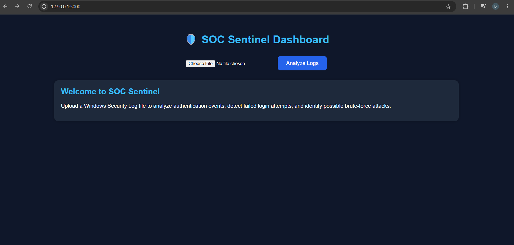
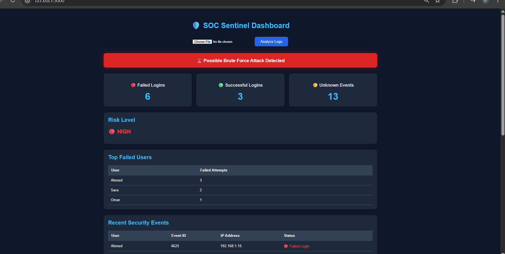

# 🛡️ SOC Sentinel

SOC Sentinel is a lightweight Security Operations Center (SOC) dashboard developed with **Python** and **Flask** for analyzing Windows Security Event Logs.

The application helps security analysts identify failed login attempts, detect potential brute-force attacks, classify risk levels, and generate a clear security overview from uploaded Windows Event Logs.

---

## 📌 Features

- Analyze Windows Security Event Logs
- Detect Failed Login Attempts (Event ID 4625)
- Count Successful Logins (Event ID 4624)
- Detect Possible Brute Force Attacks
- Automatic Risk Classification (Low / Medium / High)
- Display Security Statistics
- Show Recent Security Events
- Identify Top Failed Users
- Generate Security Analysis Dashboard

---

## 🖥️ Dashboard Preview

### Home Screen



### Analysis Results



---

## 📂 Project Structure

```
SOC-Sentinel/
│
├── app.py
├── analyzer.py
├── report.py
├── requirements.txt
├── sample_logs.txt
├── README.md
│
├── templates/
│   ├── index.html
│   └── result.html
│
├── static/
│   ├── style.css
│   └── script.js
│
└── images/
    ├── dashboard-home.png
    └── analysis-results.png
```

---

## ⚙️ Technologies Used

- Python
- Flask
- HTML5
- CSS3
- JavaScript
- Windows Security Event Logs

---

## 🚀 Installation

Clone the repository:

```bash
git clone https://github.com/DimaSec04/SOC-Sentinel.git
```

Move into the project directory:

```bash
cd SOC-Sentinel
```

Install the required packages:

```bash
pip install -r requirements.txt
```

Run the application:

```bash
python app.py
```

Open your browser and visit:

```
http://127.0.0.1:5000
```

---

## 📊 Detection Logic

The application analyzes uploaded Windows Security Logs and performs:

- Failed login detection
- Successful login counting
- Brute-force attack identification
- Risk level classification
- User activity statistics
- Recent event tracking

---

## 📁 Sample Log

A sample Windows Event Log is included:

```
sample_logs.txt
```

It can be uploaded directly to test the application.

---

## 🔮 Future Improvements

- Support additional Windows Event IDs
- Export PDF security reports
- Interactive charts
- User authentication
- Database integration
- Real-time event monitoring

---

## 👩‍💻 Author

**Dima Raaed**

Cybersecurity Student

GitHub:
https://github.com/DimaSec04

---

## 📄 License

This project is developed for educational purposes.
